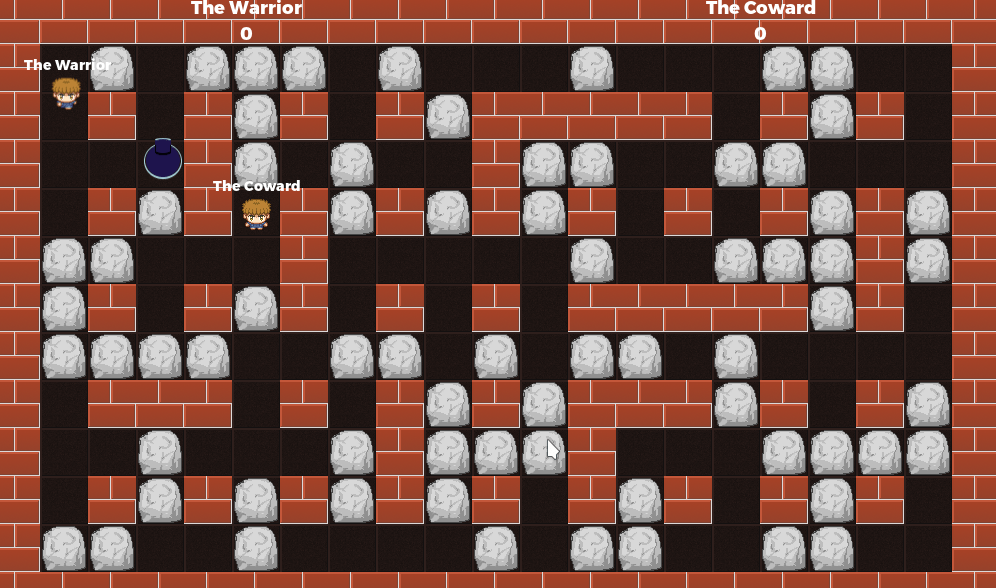

# Multiplayer Bomber - WebRTC

A multiplayer (WebRTC) implementation of the classical bomberman game.

Instructions will follow.

This is an updated version (new syntax, minor fixes etc.) for Godot 3.5+. It is based on a more recent version from https://github.com/godotengine/godot-demo-projects/tree/master/networking/multiplayer_bomber . 

Language: GDScript

Renderer: GLES 2

## Screenshots

